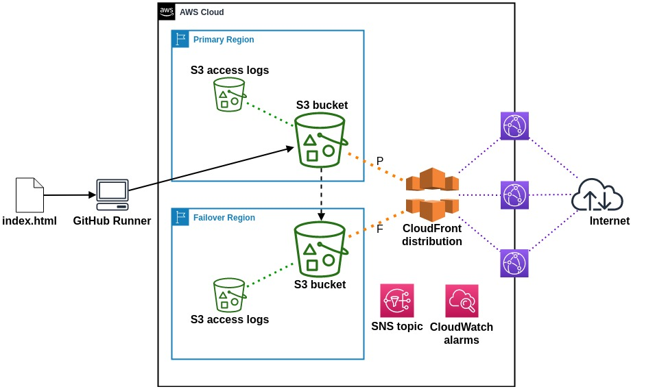

The goal of this project is to become more familiar with [Terraform](https://www.terraform.io/) and HCL native syntax. Modules provided in this repository will replicate the infrastructure in use.

This repository only contains materials used or produced while learning and should never be used in any production environment.

# [nlueckenhoff.github.io](https://nlueckenhoff.github.io)

# aws-cf-static overview
A scheduled [GitHub Actions](https://github.com/features/actions) runner puts the index.html object to an S3 access point for a bucket in Primary Region. The object is copied to another S3 bucket in Failover Region via cross-region replication. Separate buckets in both regions receive S3 server access logs.

A CloudFront distribution is configured with an origin group containing the main S3 bucket from each region. The bucket in Primary Region operates as the primary origin for the distribution while the bucket in Failover Region acts as a failover origin.

Appropriate IAM policies are generated with least privilege necessary and attached. Bucket policies are generated to enforce secure transport and block public access. SNS topics and CloudWatch alarms are not included in the module but can be created separately to track desired metrics such as the number of requests to the CloudFront distribution over a defined time period.

The result is a CloudFront distribution that delivers the static site with high availability. Each S3 bucket blocks all public access and HTTPS requests are served/enforced. The main advantage of this approach is a reduction in cost of data out of S3 (free to CloudFront), TLS enforcement (S3 website endpoints do not support HTTPS), and the protections provided by AWS Shield standard.
